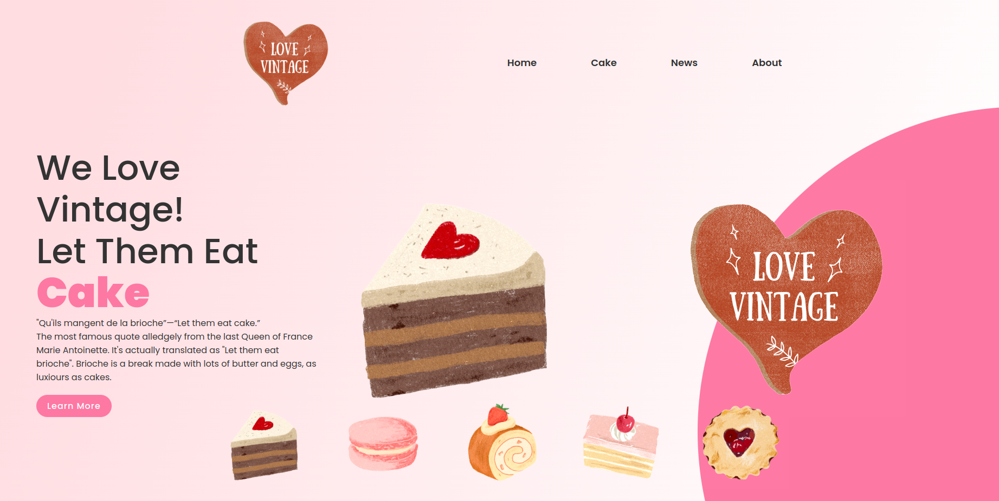

# Pastry Shop Landing Page
[>> Demo](http://127.0.0.1:5500/index.html)

---

## HTML File:

- Create a basic structure for a web page
- Define a **head section** containing the page title, meta tags, and links to external stylesheets
- Define a body section containing several sections and a header
- Use **semantic tags** like section, header, and ul to provide structure and meaning to the content
- Create a header with a logo and navigation links
- Create a main section with a textbox and an image, and use CSS classes to style the elements

## CSS File 9 (in the Assets Folder):

- Define default styles for all elements on the page using the universal selector (*)
- Use **flexbox** to create a responsive layout for the header and main sections
- Use position: relative to position some elements within their parent containers
- Use background to apply a linear gradient background to the main section
- Use font-family to specify fonts for the page
- Use border-radius to round the corners of some elements
- Use text-decoration to remove underlines from links
- Use :hover to apply styles when the user hovers over links or elements
- Use transform to create hover effects on the thumbnail images
- Use **clip-path** to create a circular background element in the footer

